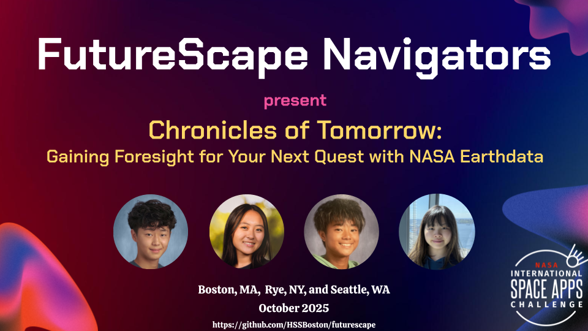

  

We are a team of 4 students who participated in the [2025 NASA Space Apps Challenge](https://www.spaceappschallenge.org/2025/):

- [Shun Nagata](https://github.com/shunnagata35)
- [Hanna Suzuki](https://github.com/HSSBoston/)
- Rei Nagata
- Konomi Karube

NASA Space Apps Challenge is an annual hackathon event (or an innovation incubation and civic engagement program) where NASA puts out about 20 challenges for participants around the world to develop innovative solutions.

We participated in the [Boston regional contest](https://www.spaceappschallenge.org/2025/local-events/boston/) of Space Apps, and won Honorable Mention and Amazon AWS Award. 

- [Official team web page](https://www.spaceappschallenge.org/2025/find-a-team/futurescape-navigators/?tab=project) at SpaceAppsChallenge.org
- [7-page project summary](https://docs.google.com/presentation/d/1e3Kvd_qfm2isCm5xuYmzgIN8jB0gbaObtXhRDeRNjJ0/edit?slide=id.g1b0e7df1845_2_75#slide=id.g1b0e7df1845_2_75)
- [Oral Presentation slides](https://docs.google.com/presentation/d/166a0fMkDra3B9j8fxCaG4QLcnFUE1G8V7Rina4QTMiw/edit?usp=sharing) at Boston local judging

## Project Summary:

The FutureSpace Navigators is a team of four high school students. We worked on a wide range of data analytics to estimate the likelihood of certain weather conditions at a location and time with NASA EarthData.

#### (1) Estimating heat stress and risk in outdoor activities

#### (2) Estimating the pleasure and productivity of fishing

#### (3) Estimating the chances of weather-related pain and other symptoms

#### (4) Estimating the visibility of auroras
